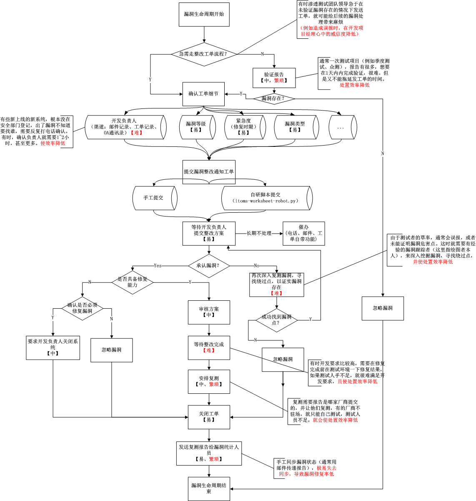

在甲方单位从事了将近两年的漏洞生命周期管理工作，所在的银行没有SRC(应急响应中心)，每个季度会有一次测试项目，测试项目是外包给了测试厂商来做，测试厂商测试完后，将每个系统的漏洞报告，打成一个包，发给我。此时，我的工作就开始了，我要将漏洞通知给负责各系统开发的项目经理，帮助和指导他们修复漏洞。漏洞是以工单的形式通知给开发项目经理的。我们的工单系统其实就类似一个SRC,但是远没有SRC那么好用。

现在将我的漏洞生命周期管理工作总结如下，用红色字体标注了此管理流程中常见的一些难点。作为我这两年从事这项工作的一些总结。

为了这个项目，我还开发了一个自动批量派发工单给开发负责人的脚本，来提高漏洞处置效率。我给它起名为xxxxx-worksheet-robot(xxxxx是我们工单系统的名称，这里隐去)

